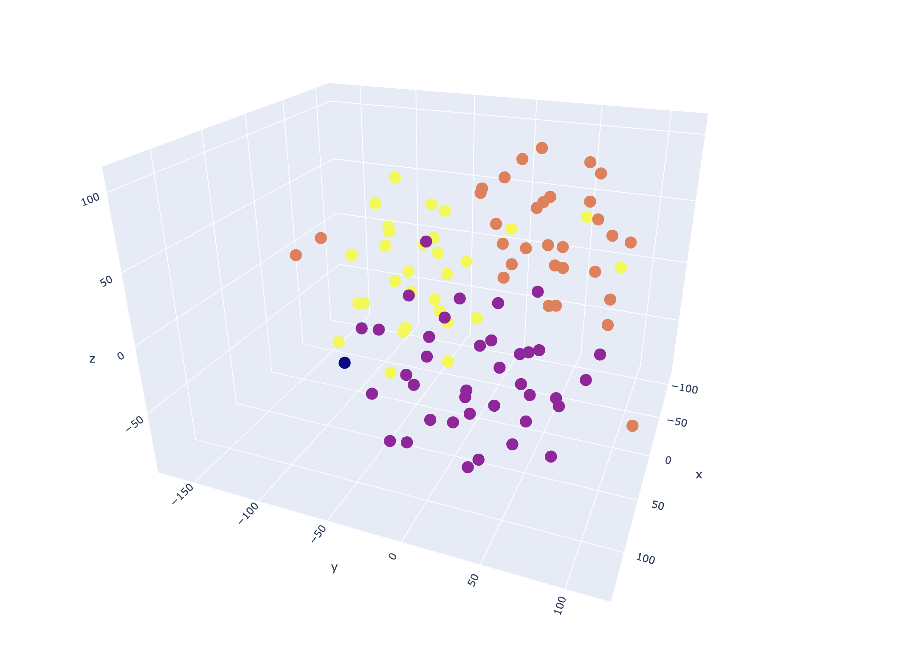

<h1 align="center" id="title">Spotify Nebula 🪐</h1>

Visualize and discover more of what you love listening to.

  &nbsp;&nbsp;
  &nbsp;&nbsp;
  

<h2>🛠️ Features</h2>

- Implemented relational database support for PostgreSQL/SQLite3 using SQLAlchemy to safely store user authentication tokens, spotify access tokens, and expiry timestamps.
- Utilized a Python/FastAPI backend for external API calls (Spotify Web API, SoundNet API) and internal endpoints.
- Pipelined dense quantitatve audio data through dimensionality reduction and clustering algorithms (t-SNE and DBSCAN) using numpy and scikit-learn.
- Created an interactive dashboard using ReactJS to visualize a user's Spotify taste nebula.

<h2>🚀 Tech Stack</h2>

- Languages: Python, Javascript, HTML, CSS
- Database: SQLite3(inital development), PostgreSQL(migrated to later)
- Frameworks/Libraries: FastAPI, ReactJS, SQLAlchemy, Pydantic, Scikit-learn
- APIs: Spotify Web API, SoundNet Audio Feature API

<h2> Demo Screenshots<h2>

- Final dashboard built with ThreeJS and React

<h3>Development Screenshots<h3>

- Initial visualization with Plotly

- Link to demo: https://drive.google.com/file/d/11vaPjYpVOHIJO-LCL2yXALcr2TxTJ_oA/view
<h2>⏰ WIP</h2>

- Optimized clustering algorithim of choice
- Deprecated Spotify audio features endpoint workaround

<h2>Collaborators</h2>

- [Evan Sun](https://github.com/evansun06) 
- [Ryan Liu](https://github.com/lyanriu8)

